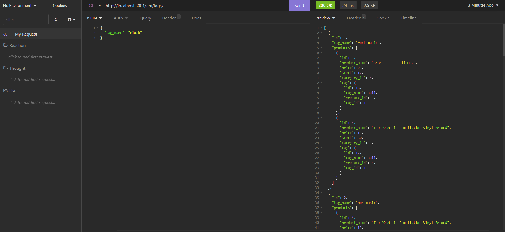

## E-Commerce Backend 

## Description
This app is to keep an e-commerce website updated with categories, products, and different tags for the products. 

Here is a screenshot of the insomnia routes in action. 

## Techologies Used:
* Dotenv
* Express.js
* Insomnia
* JavaScript
* MySQL2
* Node.js
* Sequelize

## Installation 
* Please enter npm install to install the technologies used to create this.
* Next, please install Dotenv, Mysql2, and Sequelize as well.
* To see the database in Mysql, please enter mysql -u root -p, and enter your password. 
* Then, please source the database.
* This is all demonstrated in the part 1 video walk through.

## Usage
* After looking at the database, please enter npm run start to start up Insomnia.
* With Insomnia, users can implement CRUD methods with the data given. 

## Links
* GitHub: https://github.com/krod2016/ecommerceBackend
While recording the walk through video, the recorder cut off. The second video attached is the last part of the walk through. 
* Part 1: https://drive.google.com/file/d/1lD-wDnuCt4N0Txc5m86pA99Z0WHQHm9u/view
* Part 2: https://drive.google.com/file/d/1PfH85pxAT-b1G6FKhmEvnUjzVvU9RGGC/view 

## Made By: 
Katrina Rodriguez